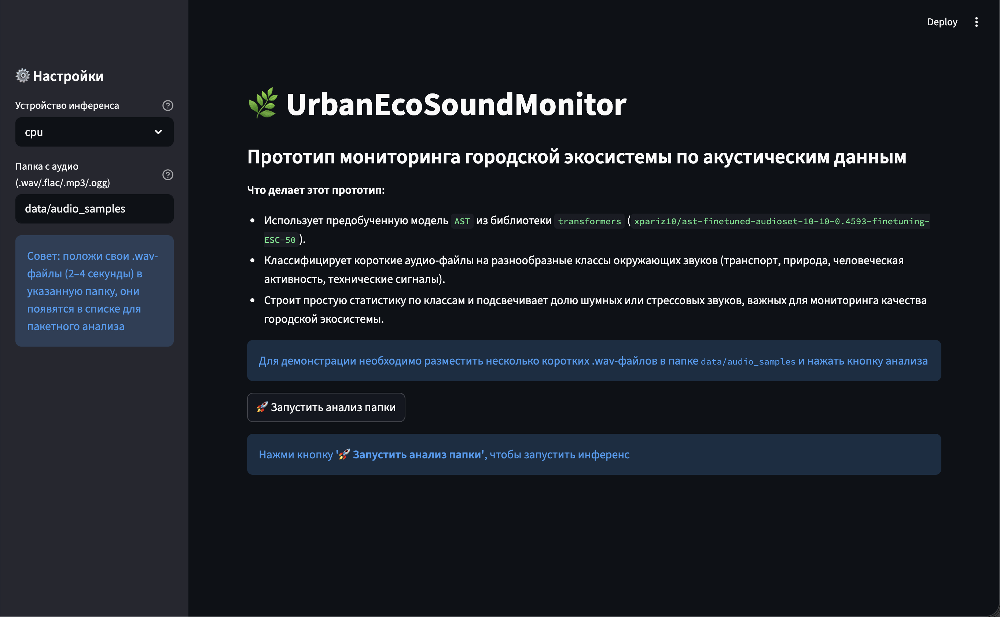
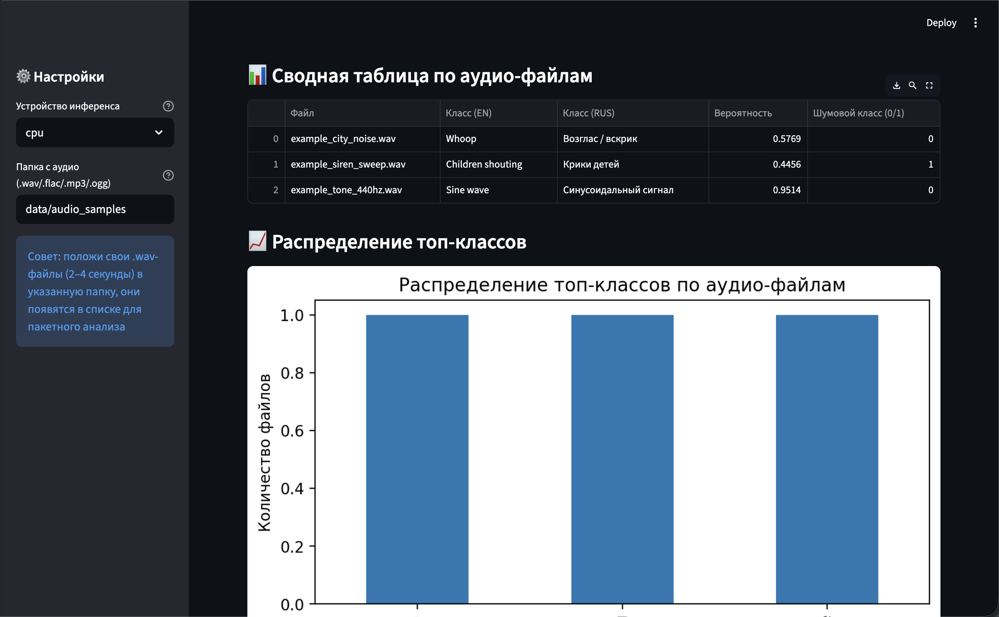
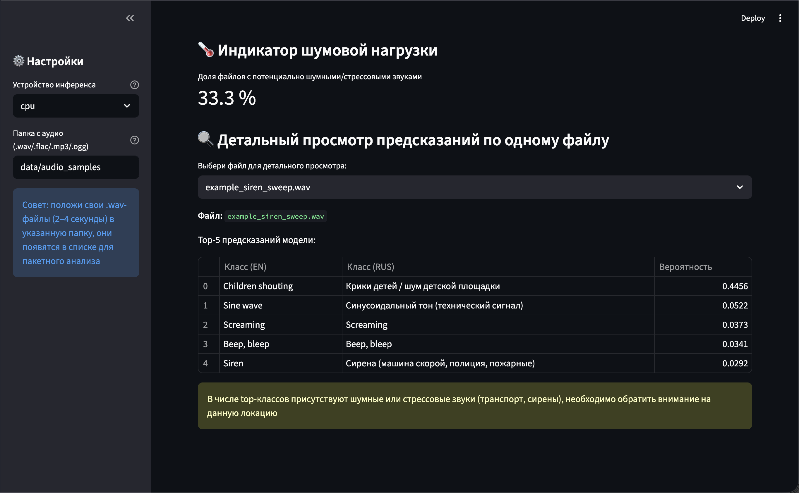

# 🌿 UrbanEcoSoundMonitor

## Акустический мониторинг городской экосистемы

Учебный проект в рамках темы **"Мониторинг экосистемы через IT-решения"**.

Пакет можно использовать как самостоятельный мини‑проект:
достаточно скачать папку `UrbanEcoSoundMonitor/`,
установить зависимости и запустить `python run_project.py --mode streamlit`.

---

### 🎯 Идея проекта

Городская экосистема испытывает шумовую нагрузку: транспорт, стройка, сирены, лай собак, выстрелы и другие источники
городского звукового фона.

**UrbanEcoSoundMonitor** -> прототип системы, которая:

- принимает короткие аудиофрагменты (1-4 секунды);
- классифицирует их по типу звука с помощью предобученной модели  
  **MIT/ast-finetuned-urban8k** (датасет UrbanSound8K);
- собирает статистику по классам звуков;
- вычисляет долю шумных или опасных аудио‑событий;
- формирует предупреждение, если уровень шумового загрязнения превышает порог.

Система может быть использована экологами и городскими службами для оценки состояния городской среды и принятия решений.

---

### 🧱 Структура проекта

```
UrbanEcoSoundMonitor/
│
├── __init__.py
├── README.md
├── requirements.txt
├── run_project.py
├── streamlit_app.py
├── urban_ecosystem_sound_monitoring.ipynb
│
└── data/
    └── audio_samples/
        └── example_dog_bark.wav
```

Модель HuggingFace автоматически скачивается в локальный системный кеш  
(`~/.cache/huggingface/` или `~/Library/Caches/huggingface/`).

### 🧽 Как удалить модели при необходимости

Очень просто:

```bash
rm -rf ~/Library/Caches/huggingface/hub
```

или более точечно:

```bash
rm -rf ~/Library/Caches/huggingface/hub/models--MIT--ast-finetuned-urban8k
```

---

### ⚙️ Установка и запуск

#### 1. Скачивание проекта

```bash
git clone https://github.com/IgorPont/mephi_homework_tasks
cd mephi_homework_tasks/sessions_tasks/project_practice/semester01/UrbanEcoSoundMonitor
```

или просто скопировать папку `UrbanEcoSoundMonitor/`.

---

#### 2. Создать виртуальное окружение

```bash
python -m venv .venv
source .venv/bin/activate    # macOS / Linux
# .venv\Scripts\activate.bat # Windows
```

---

#### 3. При необходимости сгенерировать тестовые аудио-файлы

```bash
python generate_test_audio.py
```

--- 

#### 4. Запустить проект

### Streamlit‑режим (основной способ демонстрации):

```bash
python run_project.py --mode streamlit
```

**Скрипт:**

- установит зависимости из `requirements.txt`;
- запустит веб‑интерфейс приложения.

---

### 📘 Содержание ноутбука `urban_ecosystem_sound_monitoring.ipynb`

1. **Постановка задачи:**
    - проблема шумового загрязнения,
    - цель: мониторинг с помощью ML.

2. **Загрузка предобученной модели:**
    - `MIT/ast-finetuned-urban8k` через HuggingFace,
    - получение списка классов.

3. **Подготовка данных:**
    - создана папка `data/audio_samples`,
    - поддержка пользовательских `.wav` файлов.

4. **Функции решения:**
    - `classify_audio_file()` -> анализ одного файла,
    - `analyze_directory()` -> пакетная обработка папки.

5. **Аналитика и графики:**
    - таблица с результатами,
    - бар‑чарт распределения классов.

6. **Логика тревог:**
    - выделение шумных классов (siren, drilling, gun_shot, jackhammer),
    - вычисление доли критичных событий.

Полная структура, комментарии и docstring включены.

---

### 🌐 Streamlit‑приложение

`streamlit_app.py` предоставляет удобный UI:

#### 1. Анализ одного файла:

- загрузка `.wav`,
- визуализация массива вероятностей,
- отображение уверенности модели.

#### 2. Анализ директории:

- выбор папки (по умолчанию `data/audio_samples`),
- таблица с результатами,
- сохранение состояния.

#### 3. Статистика:

- распределение событий по классам,
- выделение шумовых категорий,
- текстовая интерпретация угрозы.

---

### 🧠 Используемые технологии

| Библиотека              | Назначение                                 |
|-------------------------|--------------------------------------------|
| **Transformers**        | Загрузка и применение предобученной модели |
| **torchaudio**          | Чтение и преобразование аудиофайлов        |
| **Streamlit**           | Веб‑интерфейс и визуализация               |
| **Pandas / Matplotlib** | Таблицы и графики                          |

---

### 🧬 Как работает модель AST

В проекте используется модель **AST (Audio Spectrogram Transformer)**
Трансформер, который изначально был предложен для обработки изображений (Vision Transformer),
но здесь применяется к **аудиоспектрограммам**.

Кратко пайплайн выглядит так:

1. **Сырой аудиосигнал (waveform)** приводится к моно и фиксированному частотному диапазону (обычно 16 кГц).
2. На основе сигнала строится **лог- мел-спектрограмма**, то есть "картинка", показывающая, как распределена энергия
   по частотам во времени.
3. Спектрограмма разбивается на **патчи** (небольшие "квадратики" изображения), которые подаются в трансформер
   как последовательность токенов.
4. Трансформер (AST) учится распознавать характерные паттерны звука (шумы города, лай собак, сирены, транспорт).
5. На выходе работает **классификационная голова**, которая дает распределение вероятностей по классам звуков.

В данном прототипе используется предобученная модель `MIT/ast-finetuned-urban8k`,
дообученная на датасете **UrbanSound8K**, где собраны типичные городские звуки.
Это позволяет сразу решать задачу мониторинга экосистемы без собственного обучения нейросети.

---

### 📸 Демонстрация работы приложения

Ниже приведены примеры работы прототипа.

#### 1. Главный экран Streamlit-приложения



#### 2. Результаты анализа и статистика






---

### 🚀 Итоги и перспективы

**В прототипе реализовано:**

1. Использование предобученной ML‑модели для экозадачи;
2. Классификация шумовых событий;
3. Визуализация и выявление аномалий;
4. Удобный интерфейс для демонстрации.

**Потенциальное развитие:**

- Геопривязка аудиозаписей;
- Карта шумового загрязнения;
- Интеграция с датчиками IoT;
- Прогнозирование шумовых всплесков.

---
